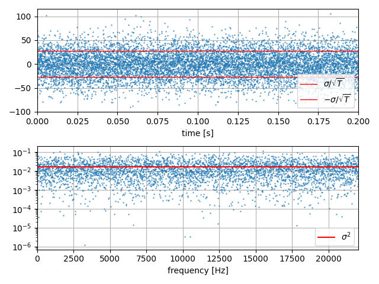
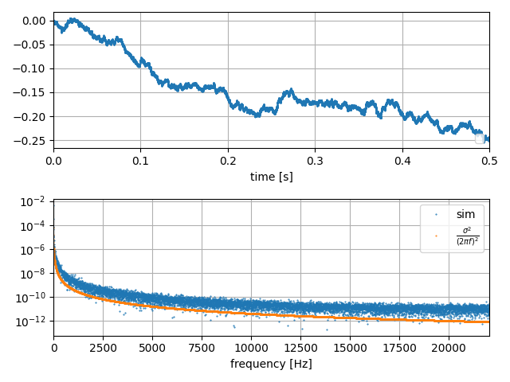

# 1. Noise

We think a signal $w(t)$ whose statistics are

$ \frac{1}{T}\int_{-T/2}^{T/2} w(t) dt = 0$

$ \frac{1}{T}\int_{-T/2}^{T/2} w(t)w(t-\tau) dt = \sigma^2 \delta(t-\tau)$

We write this as

$E[w(t)] = 0$

$E[w(t)w(t-\tau) ] = \sigma^2 \delta(t-\tau)$

I am understanding idea of Fourier transform from this equation:

$f(t) = \frac{1}{2\pi} \int_{-\infty}^\infty dt^\prime \int_{-\infty}^\infty df \left[f(t^\prime) \exp(-2\pi f(t-t^\prime))\right]$ 

## Wtite Noise

White noise is random signal whose power spectral density is flat. Inverse Fourier transform of power spectral density is auto correlation. Here $\sigma$ is noise density. 

If we simulate this in descrete signal, for example sampling rate is $F_s$ [Hz] or $F_s$ samples in a second, how can we generate the signal? Let's assume $x(t)$ is a signal of voltage. Unit of $x(t)$ is volt. Power spectral density unit is square of volt per Hertz. So squre root of this is The answer is 

$ x_i = \sigma \sqrt{F_s} w_i$

Here is the plot. You can very that the result id independet from the sampling rate.

We can say the independency from sampling rate is in another way.
Power or energy in one second must be equal if it is calculated in time domain or in frequency domain.
In time domain, 

$\sum_{i=1}^Fs x_i^2 \Delta t = Var[x_i] \frac{1}{Fs}= \sigma^2 F_s$

Frequecy domain, since it is constant as $\sigma^2$ in the limited band width of $F_s$ Hz, the power is $\sigma^2 Fs$.
This should be calculated from DFT directly.

$\sum_{m=1}^M X_m^2 \frac{F_s}{M} = M \sum_{i=1}^N x_i^2 \frac{F_s}{M}$

## Random Walk

Random walk is usually introduced in descrete random process and that is a very correct way. I think we can simply define continuous time process. Time derivertive of the sandom signal is white noise.

$\frac{d}{dt} y(t) = x(t)$

If $x(t)$ is defined as white noise with noise density $\sigma$, as in the previous section, we can simulate $y(t)$ in the same manner. Since time derivertive $\frac{d}{dt}$ become polynomial $-2\pi jf$

$ -2\pi f Y(f) = X(f)$

Multiplying conjugate of this, the power is

$ |Y(f)|^2 = \frac{|X(f)|^2}{4\pi^2f^2}$

In the same manner of white noise, we can simulate this like this. Sampling rate limit the power, and the spectral density does not depned of sampling rate.

