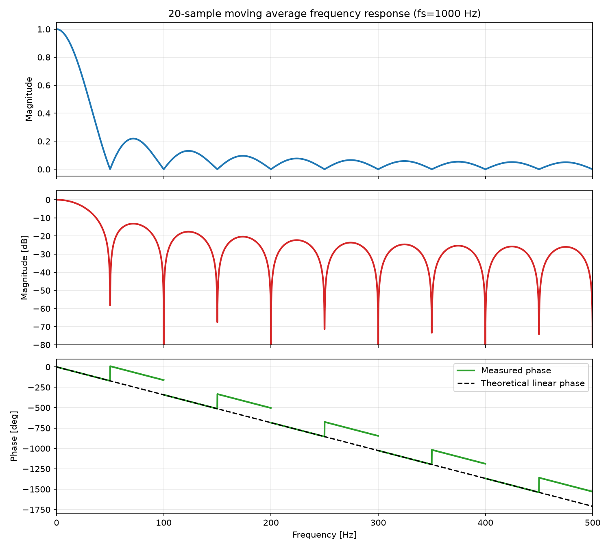

# Moving Average

Sampling frequency is 1000 Hz, and we apply a 20-tap moving average filter.

The filter is

$$
y[n] = \frac{1}{20} \sum_{k=0}^{19} x[n-k].
$$

Its transfer function is

$$
H(z) = \frac{1}{20}\sum_{k=0}^{19} z^{-k}
= \frac{1}{20}\frac{1-z^{-20}}{1-z^{-1}}.
$$

The frequency response is

$$
H\left(e^{j\omega}\right)
= \frac{1}{20}e^{-j\omega\frac{19}{2}}
\frac{\sin\left(10\omega\right)}{\sin\left(\omega/2\right)}.
$$

Therefore,

$$
\left|H\left(e^{j\omega}\right)\right|
= \frac{1}{20}\left|\frac{\sin\left(10\omega\right)}{\sin\left(\omega/2\right)}\right|,
$$

and the linear phase term is

$$
\phi(\omega) \approx -\omega\frac{19}{2}
\quad\left(\text{or }\phi(f) = -180\frac{19}{1000}f\;[\mathrm{deg}]\right).
$$

The first null appears at 50 Hz, and nulls repeat every 50 Hz.

Frequency response plot:

