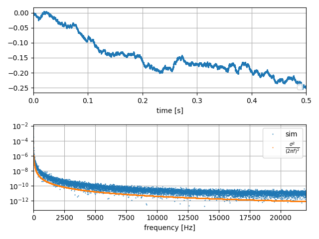

# Random Walk

Random walk is usually introduced as a discrete random process, and that is a very correct way. We can also define it as a continuous-time process: the time derivative of the random signal is white noise.

$$
\frac{d}{dt}y(t) = x(t)
$$

If $x(t)$ is defined as white noise with noise density $\sigma$, as in the previous section, we can simulate $y(t)$ in the same manner. Since time derivertive $\frac{d}{dt}$ become polynomial $-2\pi jf$

$$
-2\pi fY(f) = X(f)
$$

Multiplying conjugate of this, the power is

$$
|Y(f)|^2 = \frac{|X(f)|^2}{4\pi^2f^2}
$$

In the same manner of white noise, we can simulate this like this. Sampling rate limit the power, and the spectral density does not depned of sampling rate.

