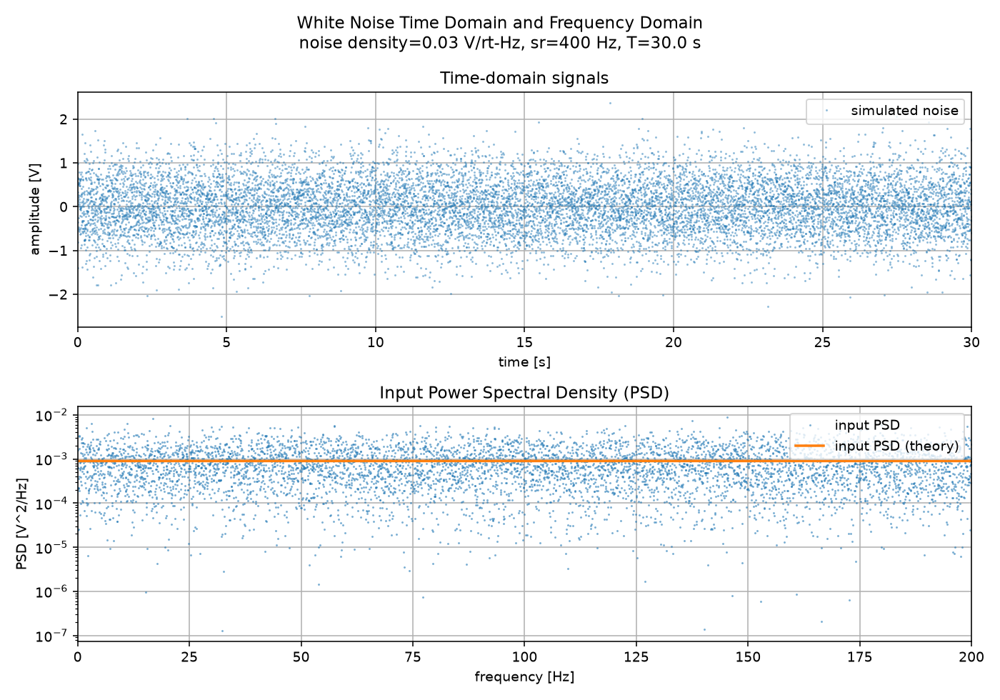
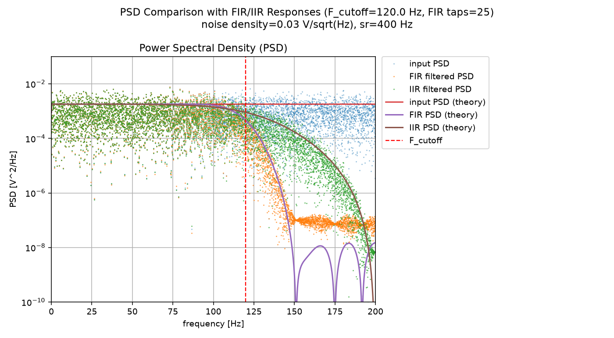

# White Noise

White noise is a random signal whose power spectral density is flat. The inverse Fourier transform of the power spectral density is the autocorrelation, which is nonzero only when the time points coincide.

$$
R(t_1,t_2) = \sigma^2 \delta(t_1 - t_2)
$$

or it depends only on time lag in the stationary state,

$$
R(\tau) = \sigma^2 \delta(\tau)
$$

Here $\sigma$ is noise density.

## Simulation

If we simulate this as a discrete signal, for example with sampling rate $F_s$ [Hz] ($F_s$ samples per second), how can we generate the signal? Let's assume $x(t)$ is a signal from some sensor. The unit of $x(t)$ might be voltage, or a physical unit like degree per second (dps) in a gyroscope, g in an accelerometer, and so on.

We can sample an independently distributed random variable $w_i$ from a Gaussian distribution in computation.

$$
x_i = \sigma\sqrt{F_s}\,w_i = \frac{\sigma}{\sqrt{T_s}} w_i
$$

$$
w_i \sim N(0,1)
$$

### Power Spectrum and Noise Density

Here is the plot. You can verify that the result is independet from the sampling rate, using python script. Spectrum density should be always $\sigma^2$ with any sampling rate, in the unit of valtage square per Hertz.

### Verification

We can say the independency from sampling rate is in another way.
Power or energy in one second must be equal if it is calculated in time domain or in frequency domain.
In time domain,

$$
\sum_{i=1}^{F_s} x_i^2\Delta t = \mathrm{Var}[x_i]\frac{1}{F_s} = \sigma^2F_s
$$

Frequecy domain, since it is constant as $\sigma^2$ in the limited band width of $F_s$ Hz, the power is $\sigma^2 Fs$.
This should be calculated from DFT directly.

$$
\sum_{m=1}^{M} X_m^2\frac{F_s}{M} = M\sum_{i=1}^{N} x_i^2\frac{F_s}{M}
$$

### Filtering

