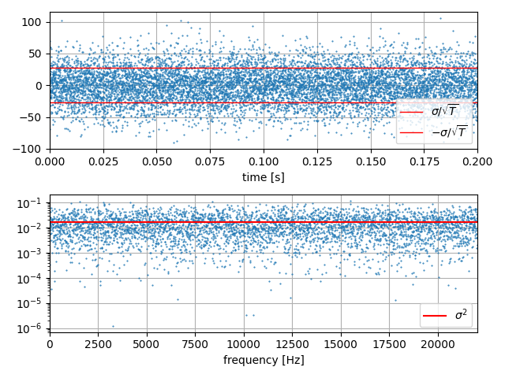

# White Noise

White noise is random signal whose power spectral density is flat. Inverse Fourier transform of power spectral density is auto correlation, which has correclation only at the same time point. 

$$
R(t_1,t_2) = \sigma^2 \delta(t_1 - t_2)
$$

or it depends only on only time lag in stationary state,

$$
R(\tau) = \sigma^2 \delta(0)
$$

Here $\sigma$ is noise density.

## Simulation

If we simulate this in descrete signal, for example sampling rate is $F_s$ [Hz] or $F_s$ samples in a second, how can we generate the signal? Let's assume $x(t)$ is a signal of some sensor. Unit of $x(t)$ is for example voltage, or might be physical unit like degree per second(dps) in gyroscope, gravity unit in accelerometer, and so on.

We can sample independetly distributed random variable $w_i$ from Gaussian distribution in computation.

$$
x_i = \sigma\sqrt{F_s}\,w_i = \frac{\sigma}{\sqrt{T_s}} w_i
$$

$$
w_i \sim N(0,1)
$$

### Power Spectrum and Noise Density

Here is the plot. You can verify that the result is independet from the sampling rate, using python script. Spectrum density should be always $\sigma^2$ with any sampling rate, in the unit of valtage square per Hertz.

### Verification

We can say the independency from sampling rate is in another way.
Power or energy in one second must be equal if it is calculated in time domain or in frequency domain.
In time domain,

$$
\sum_{i=1}^{F_s} x_i^2\Delta t = \mathrm{Var}[x_i]\frac{1}{F_s} = \sigma^2F_s
$$

Frequecy domain, since it is constant as $\sigma^2$ in the limited band width of $F_s$ Hz, the power is $\sigma^2 Fs$.
This should be calculated from DFT directly.

$$
\sum_{m=1}^{M} X_m^2\frac{F_s}{M} = M\sum_{i=1}^{N} x_i^2\frac{F_s}{M}
$$
